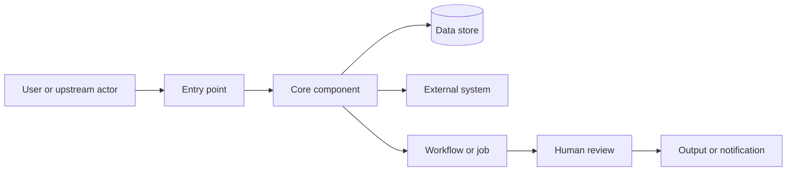

# Architecture Diagram Template

Use a portable text diagram or Mermaid when rendering support is appropriate.

## Rules

- Show only material components.
- Label boundaries and external systems.
- Show direction of data or control flow.
- Do not include secret values or sensitive record examples.
- Mark inferred components or connections in accompanying text.
