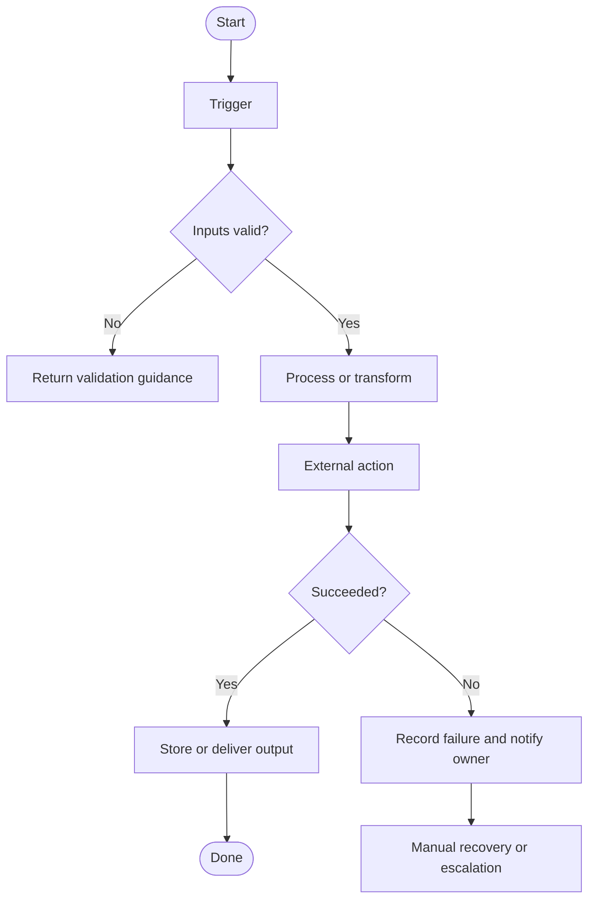

# Workflow Diagram Template

## Rules

- Use exact action names only when confirmed.
- Include material branches, loops, approvals, and external actions.
- Show failure and recovery paths, not only the happy path.
- Identify where retries may create duplicates.
